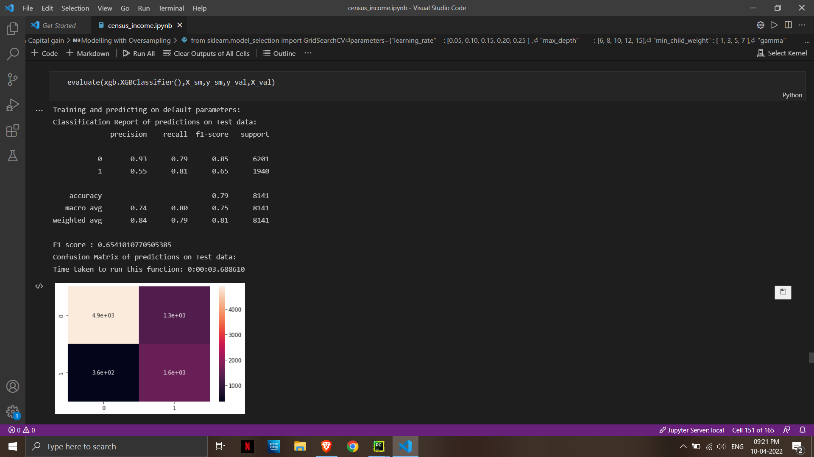

# Introduction:
US Adult Census data relating income to social factors such as Age, Education, race etc. The Us Adult income dataset was extracted by Barry Becker from the 1994 US Census Database. The data set consists of anonymous information such as occupation, age, native country, race, capital gain, capital loss, education, work class and more. Each row is labelled as either having a salary greater than ">50K" or "<=50K".
- Note that the dataset is made up of categorical and continuous features. It also contains missing values The categorical columns are: workclass, education, marital_status, occupation, relationship, race, gender, native_country.Note that the dataset is made up of categorical and continuous features. It also contains missing values The categorical columns The categorical columns are: workclass, education, marital_status, occupation, relationship, race, gender, native_country.
- The dataset consist of 32561 rows and 1 features .
### Dataset:
- The data here is for the "Census Income" dataset, which contains data on adults from the 1994 census. This data is labeled with whether the person's yearly income is above or below $50K.

### WorkFlow:
-  Perform data cleaning using pandas library. Which includes replacing the miscoded information and handling missing data.
-  Make a Exploratory Data Analysis on the data using pandas.
-  Visualize distributions and correlation of features using seaborn and pandas
-  Build a classification model for the classification of income.
-  Try different classifiers and compare the accuracy of all the classifiers.

### Conclusion:
- In this project, we build various models like logistic regression, knn classifier, GaussianNB random forest classifier and xgboost classifier.
- A hyperparameter tuned XGBOOST gives the highest and f1 score . 

### Future Work:
- We have a large enough dataset, so we can use neural networks such as an artificial neural network to build a model which can result in better performance.
